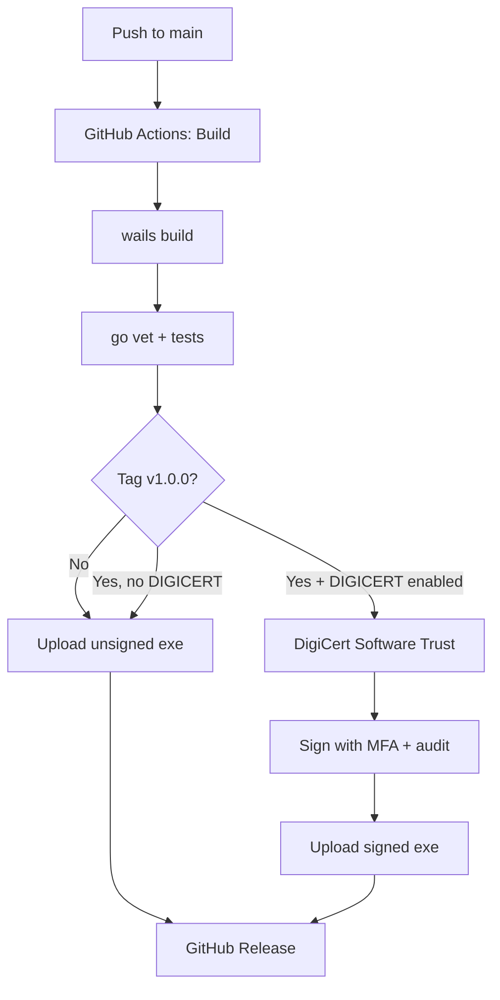

# 🔐 Hướng dẫn Code Signing & Deployment cho BCY-VKS

> **Tài liệu tổng hợp** các kỹ thuật code signing được tham khảo từ:
> 
> 1. **DigiCert Software Trust Manager** — https://github.com/digicert/code-signing-software-trust-action
>    Cloud signing với MFA, audit logs, no local .pfx, cross-platform
> 
> 2. **gsudo** — https://github.com/gerardog/gsudo
>    Sudo for Windows: 1 UAC popup, nhiều lệnh elevated, portable, hỗ trợ script
> 
> 3. **certerator** — https://github.com/stufus/certerator
>    Authenticode cert generator + installer: Subject chuẩn, EXE metadata, cài vào cả 2 stores

---

## 📋 Tổng quan 3 chế độ ký số

| Chế độ | Chi phí | Phạm vi | SmartScreen | Khi nào dùng |
|--------|---------|---------|-------------|--------------|
| **selfsigned** | Miễn phí | Nội bộ | ✅ Trên máy có cert | Test, tổ chức có GPO |
| **production** (.pfx) | $200-300/năm | Toàn cầu | ⚠ Tuần đầu reputation | Phần mềm thương mại |
| **digicert** (cloud) | $400-700/năm | Toàn cầu | ✅ EV trusted ngay | Production enterprise |

---

## 🚀 Workflow build & sign đầy đủ



---

## 🟢 Chế độ 1: Self-signed (theo nguyên tắc certerator)

### Tạo cert và ký số

```powershell
# Yêu cầu: PowerShell Admin
# Cài signtool (Windows SDK): https://developer.microsoft.com/windows/downloads/windows-sdk/

# Cách 1: Dùng script sẵn
powershell -ExecutionPolicy Bypass -File sign-code.ps1 selfsigned

# Cách 2: Qua gsudo (nếu đã cài gsudo)
gsudo powershell -ExecutionPolicy Bypass -File sign-code.ps1 selfsigned
```

### Script tự động:

1. **Tạo Authenticode cert** với:
   - Subject: `CN=BCY-VKS - Ban Co Yeu Trung Uong, O=Ban Co Yeu Trung Uong, OU=Cyber Security Department, C=VN, ST=Ha Noi`
   - KeyUsage: DigitalSignature
   - KeyAlgorithm: RSA 2048-bit + SHA256
   - Valid: 3 năm

2. **Export backup**:
   - `build/BCY-VKS-code-signing.pfx` (private + public, password: `BCY-VKS-2026`)
   - `build/BCY-VKS-code-signing.cer` (public cert, để phân phối)

3. **Cài cert vào 2 stores** (bắt buộc theo certerator):
   - `LocalMachine\Root` (Trusted Root CA) — để Windows trust cert chain
   - `LocalMachine\TrustedPublisher` — để SmartScreen không cảnh báo "unknown publisher"

4. **Ký .exe** với timestamp (RFC 3161):
   - File digest: SHA256
   - Timestamp: `http://timestamp.digicert.com` (để cert hết hạn vẫn verify được)

### Phân phối cho máy khác (cùng cơ quan)

**Cách A — Dùng Group Policy (khuyến nghị):**

1. Trên máy dev đã ký, export `.cer`:
   ```powershell
   $cert = Get-ChildItem Cert:\CurrentUser\My | Where-Object {$_.Subject -match "BCY-VKS"}
   Export-Certificate -Cert $cert -FilePath "\\fileserver\BCY-VKS-cert.cer"
   ```

2. Tạo GPO trong Active Directory:
   - Computer Configuration → Policies → Windows Settings → Security Settings → Public Key Policies
   - Import vào **Trusted Root Certification Authorities** + **Trusted Publishers**
   - Link GPO đến OU cần áp dụng

3. Trên máy client: `gpupdate /force` → chạy `.exe` không còn SmartScreen

**Cách B — Manual qua certutil:**

```cmd
:: Cài cert vào Trusted Root
certutil -addstore -f Root "BCY-VKS-cert.cer"

:: Cài cert vào Trusted Publishers
certutil -addstore -f TrustedPublisher "BCY-VKS-cert.cer"
```

---

## 🟡 Chế độ 2: Production cert .pfx

### Mua cert từ CA

| Nhà cung cấp | OV Code Signing | EV Code Signing |
|--------------|-----------------|-----------------|
| **DigiCert** | $289/năm | $499/năm |
| **Sectigo** | $199/năm | $399/năm |
| **GlobalSign** | $249/năm | $449/năm |
| **SSL.com** | $179/năm | $379/năm |

Quy trình:
1. Đăng ký với thông tin tổ chức (giấy phép KD, mã số thuế)
2. CA xác minh KYC (1-7 ngày)
3. Nhận file `.pfx` (chứa private key + cert)

### Ký số

```powershell
powershell -ExecutionPolicy Bypass -File sign-code.ps1 production `
    -PfxPath "C:\certs\BCY-VKS-OV.pfx" `
    -CertPassword "secure_password"
```

### Reputation building

SmartScreen có cơ chế "reputation" — cert OV mới có thể vẫn cảnh báo 1-2 tuần đầu. Sau khi nhiều người chạy .exe đã ký, reputation tăng → popup biến mất.

Cách tăng reputation nhanh:
- Submit file tới Microsoft: https://www.microsoft.com/wdsi/filesubmission
- Đăng ký Microsoft Partner Center
- Phát hành qua Windows Package Manager (winget)

---

## 🔴 Chế độ 3: DigiCert Software Trust Manager (cloud)

### Lợi ích

- ✅ **MFA** bắt buộc khi ký số
- ✅ **Audit logs** mọi thao tác ký
- ✅ **No local .pfx** — private key trong cloud
- ✅ **Cross-platform** (Windows/Linux/macOS)
- ✅ **EV-style trusted ngay lập tức**
- ✅ **Bulk signing** (ký nhiều file cùng lúc)

### Yêu cầu

- DigiCert ONE account (https://www.digicert.com/software-trust-manager)
- API key
- Client cert (.p12) để MTLS

### Cách dùng

**Local (manual):**
```powershell
powershell -ExecutionPolicy Bypass -File sign-code.ps1 digicert `
    -SmHost "https://client.digicert.com/mtls" `
    -SmApiKey "your_api_key" `
    -SmClientCertFile "C:\certs\client.p12" `
    -SmClientCertPassword "client_pwd" `
    -SmCertKey "keypair_fingerprint"
```

**CI/CD (GitHub Actions):** Đã tích hợp sẵn trong `.github/workflows/build.yml`:

```yaml
sign:
  needs: build
  if: github.ref_type == 'tag' && vars.ENABLE_DIGICERT_SIGNING == 'true'
  uses: digicert/code-signing-software-trust-action@v1
  env:
    SM_HOST: ${{ vars.SM_HOST }}
    SM_API_KEY: ${{ secrets.SM_API_KEY }}
    SM_CLIENT_CERT_FILE: ./client.p12
    SM_CLIENT_CERT_PASSWORD: ${{ secrets.SM_CLIENT_CERT_PASSWORD }}
```

Cần setup:
1. Repository → Settings → Environments → tạo environment `signing` (yêu cầu manual approval)
2. Settings → Secrets and variables → Actions:
   - **Secrets:** `SM_API_KEY`, `SM_CLIENT_CERT_PASSWORD`, `SM_CLIENT_CERT_FILE_B64`
   - **Variables:** `SM_HOST`, `SM_CERT_ALIAS`, `ENABLE_DIGICERT_SIGNING=true`

---

## 🚀 Tích hợp gsudo (UX tốt hơn)

### Lợi ích gsudo

BCY-VKS cần quyền Admin để scan sâu. Thay vì bắt user right-click → Run as Administrator, dùng gsudo:

- ✅ 1 UAC popup, nhiều lệnh elevated (credentials cache)
- ✅ Output trong cùng cửa sổ console (không mở window mới)
- ✅ Portable (không cần service)
- ✅ Detect shell (CMD/PowerShell/WSL/Bash/Yori/NuShell)
- ✅ Exit code 999 nếu elevation fail (dễ xử lý)

### Cài đặt gsudo

```powershell
# Phương án 1: WinGet (built-in Windows 11)
winget install gerardog.gsudo

# Phương án 2: Scoop
scoop install gsudo

# Phương án 3: Chocolatey
choco install gsudo

# Phương án 4: Manual
# Download MSI: https://github.com/gerardog/gsudo/releases/latest
```

### Dùng launcher script

```powershell
# Tự detect gsudo + auto-elevate
powershell -ExecutionPolicy Bypass -File launch-as-admin.ps1

# Hoặc gsudo trực tiếp
gsudo .\BCY-VKS.exe

# Hoặc qua credentials cache (1 UAC, nhiều lần chạy)
gsudo config CacheMode auto
gsudo .\BCY-VKS.exe
gsudo .\sign-code.ps1 selfsigned   # không cần UAC nữa
```

---

## 🛠️ EXE Metadata (theo certerator)

SmartScreen reputation bị ảnh hưởng bởi metadata của .exe (không chỉ cert). Đảm bảo:

1. **wails.json** đã cấu hình `info` đầy đủ:

```json
{
  "info": {
    "productName": "BCY-VKS Kiem Sat An Ninh",
    "productVersion": "1.0.0",
    "copyright": "Copyright (c) 2026 Ban Co Yeu",
    "comments": "Offline Security Audit & Forensics Suite"
  },
  "author": {
    "name": "Ban Co Yeu Trung Uong",
    "email": "security@bcy.gov.vn"
  }
}
```

2. **Sau khi build**, có thể set thêm metadata chi tiết qua `set-exe-metadata.ps1`:

```powershell
powershell -ExecutionPolicy Bypass -File set-exe-metadata.ps1 `
    -ExePath "build\bin\BCY-VKS.exe" `
    -FileDescription "BCY-VKS - Kiem Sat An Ninh" `
    -CompanyName "Ban Co Yeu Trung Uong" `
    -ProductName "BCY-VKS Kiem Sat An Ninh" `
    -LegalCopyright "Copyright (c) 2026 Ban Co Yeu"
```

Cần [Resource Hacker](https://www.angusj.com/resourcehacker/) để modify metadata. Nếu chưa có, wails.json đã đảm bảo metadata cơ bản.

---

## 📦 Tổng kết scripts có sẵn

| Script | Tác dụng | Cách dùng |
|--------|---------|----------|
| `build.bat` | Build .exe + auto prompt ký số | `.\build.bat` |
| `sign-code.ps1` | Ký số 3 chế độ (selfsigned/production/digicert) | `.\sign-code.ps1 selfsigned` |
| `launch-as-admin.ps1` | Auto-elevation qua gsudo | `.\launch-as-admin.ps1` |
| `unblock-file.ps1` | Bypass SmartScreen 1 lần (gỡ Mark of Web) | `.\unblock-file.ps1` |
| `set-exe-metadata.ps1` | Set EXE metadata (cần Resource Hacker) | `.\set-exe-metadata.ps1` |
| `verify-binary.ps1` | Verify embedded assets sau khi build | `.\verify-binary.ps1` |

---

## 🎯 Khuyến nghị cho Ban Cơ Yếu

### **Giai đoạn 1: Test nội bộ (miễn phí)**

1. Build `.exe`:
   ```cmd
   .\build.bat
   ```

2. Ký số self-signed:
   ```powershell
   gsudo powershell -ExecutionPolicy Bypass -File sign-code.ps1 selfsigned
   ```

3. Phân phối qua GPO:
   - Export `.cer` từ `build/BCY-VKS-code-signing.cer`
   - Import vào `Trusted Root` + `Trusted Publishers` qua Group Policy
   - Trên máy client: `gpupdate /force`

4. Cài gsudo cho UX tốt:
   ```powershell
   winget install gerardog.gsudo
   ```

### **Giai đoạn 2: Production enterprise**

1. Mua **DigiCert Software Trust Manager** account ($499+/năm)
2. Setup GitHub Actions secrets (xem phần "Chế độ 3" ở trên)
3. Khi tag `v1.0.0` → workflow tự động:
   - Build unsigned exe
   - Sign qua DigiCert cloud (MFA + audit logs)
   - Upload signed exe
   - Tạo GitHub Release

### **Giai đoạn 3: Optimal UX**

- EV cert (immediately trusted, không cần reputation building)
- gsudo cho auto-elevation
- Submit file tới Microsoft để build reputation nhanh hơn

---

## 🔗 Tham chiếu kỹ thuật

- DigiCert Software Trust Action: https://github.com/digicert/code-signing-software-trust-action
- gsudo documentation: https://gerardog.github.io/gsudo/
- certerator research: https://labs.f-secure.com/blog/masquerading-as-a-windows-system-binary-using-digital-signatures/
- Microsoft SmartScreen: https://learn.microsoft.com/windows/security/threat-protection/windows-defender-smartscreen/
- Authenticode signing: https://learn.microsoft.com/windows-hardware/drivers/install/authenticode
- signtool.exe docs: https://learn.microsoft.com/windows-server/administration/windows-commands/signtool

---

## ⚠️ Lưu ý pháp lý

Code signing **không** đảm bảo file sạch virus. Code signing chỉ chứng minh **nguồn gốc tổ chức phát hành**. Người dùng vẫn cần kiểm tra:

- Tên tổ chức phát hành có đúng không
- Có phải phần mềm chính thức không
- Hash SHA256 có khớp với hash chính thức không

Vì lý do pháp lý, **chỉ ký số phần mềm bạn sở hữu và đã được kiểm thử**. Ký số mã độc/ mã nguồn không rõ ràng có thể vi phạm:
- Luật An ninh mạng 2018 Điều 28
- BLHS 2015 Điều 288 (Tội vi phạm quy định về bảo mật thông tin)
- Quy định của Ban Cơ Yếu về an toàn thông tin
